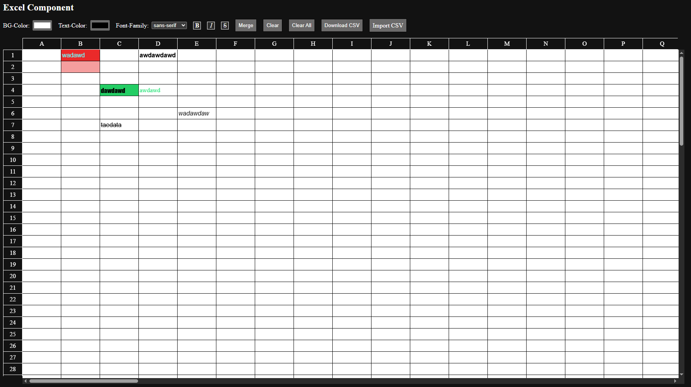

# Spreadsheet App
A spreadsheet app with basic functionality.

## Technology Used
1. React
2. React DOM
3. React Window
4. TypeScript

## Features
1. Change cell styling like color,font style
2. Basic Merge Feature
3. Download and Upload the spreadsheet in CSV

## Getting Started
### Prerequisites
Make sure you have Node.js installed on your system.

### Installation and Running
1. Clone the repository to your local machine.
2. Navigate to the project folder.
3. Install dependencies with npm install or yarn install.
4. Start the development server with npm run dev or yarn dev.
5. Open your browser and go to http://localhost:5173 (or the port shown in the terminal) to use the app.

### Building for Production
1. Run npm run build or yarn build to create an optimized production build.
2. You can preview the production build locally using npm run preview or yarn preview.

## Usage
* Click on any cell to edit the content.
* Use toolbar options to change cell font style, color, and other styling.
* Select multiple cells to merge them using the merge option.
* Download your spreadsheet as a CSV file.
* Upload a CSV file to load data into the spreadsheet.
